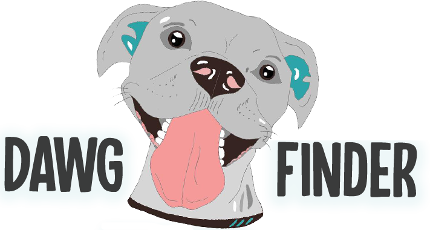

# dawg-finder

This is a web application where you can get help find the perfect dog, built with create-react-app and typescript. Project includes components, some of them are stateful.

****************************************************************************
## How to run
1. Download/clone project and open in your favorite IDE
2. Run `npm i` to install dependencies
3. Run `npm run app` to run app in the browser
4. Done!
